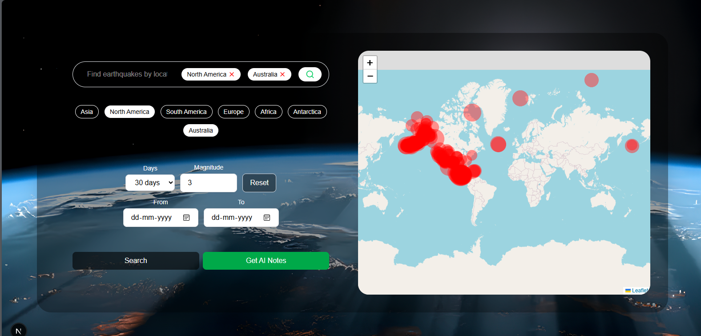

# 🌍 Earthquake Map & AI Notes Generator

A full-stack web application built with **Next.js (React + TypeScript)** that visualizes earthquake data on an interactive map and allows users to generate AI-powered notes using the **Groq API**.

---

## 🚀 Tech Stack

* **Frontend**: React (Next.js with TypeScript)
* **Mapping Library**: [Leaflet](https://leafletjs.com/) & [React-Leaflet](https://react-leaflet.js.org/)
* **State Management**: React Hooks & States (Supports SSR + CSR rendering)
* **LLM API**: Groq API (`openai/gpt-oss-20b` model)

---

## 📌 Features

1. 🔍 **Search Earthquakes by Continent**

   * Uses `haversineDistance` to match earthquake coordinates to their respective continent.

2. 📅 **Search by Date**

   * Quick date filters (e.g., past number of days).
   * Custom date range search (From & To).

3. 🔄 **Reset Filters**

   * Clears applied filters and resets the map view.

4. 📝 **AI Notes Generation**

   * Generates summaries and notes about earthquakes using the **Groq API** via `POST` request.
   * ⚠️ *Note*: Initially explored APIs without API keys, but LLM providers enforce usage limits, making keyless APIs impractical.

---

## 🌐 APIs Used

* **Default Earthquake Data (Recruiter Provided)**

  ```ts
  const defaultUrl =
      "https://earthquake.usgs.gov/earthquakes/feed/v1.0/summary/all_day.geojson";
  ```

* **Custom Date Query API**

  ```http
  GET https://earthquake.usgs.gov/fdsnws/event/1/query
  ```

---

## 📐 Haversine Distance Calculation

Used to determine the nearest continent for a given earthquake coordinate.

```ts
function haversineDistance(coord1: { lat: number; lon: number }, coord2: { lat: number; lon: number }) {
  const R = 6371;
  const dLat = ((coord2.lat - coord1.lat) * Math.PI) / 180;
  const dLon = ((coord2.lon - coord1.lon) * Math.PI) / 180;
  const lat1 = (coord1.lat * Math.PI) / 180;
  const lat2 = (coord2.lat * Math.PI) / 180;

  const a =
    Math.sin(dLat / 2) ** 2 +
    Math.sin(dLon / 2) ** 2 * Math.cos(lat1) * Math.cos(lat2);
  const c = 2 * Math.atan2(Math.sqrt(a), Math.sqrt(1 - a));
  return R * c;
}
```

---

## 📊 Functionalities Overview

* ✅ Search by **continents**
* ✅ Search by **quick dates** (last X days)
* ✅ Search by **date range** (from & to)
* ✅ **Reset filters**
* ✅ **Generate AI Notes** (via Groq LLM)

---

## ⚡ Installation & Setup

```bash
# Clone repo
git clone <repo-url>
cd earthquake-map-notes

# Install dependencies
npm install

# Run development server
npm run dev
```

Visit 👉 `http://localhost:3000`

---

## 📌 Notes

* **Groq API Key Required** – Free tier available but requires signup.
* Without an API key, LLM services cannot be integrated reliably due to usage restrictions.

---

## 📷 Screenshots 

*Add screenshots of the map, search filters, and AI notes popup here.*


---

